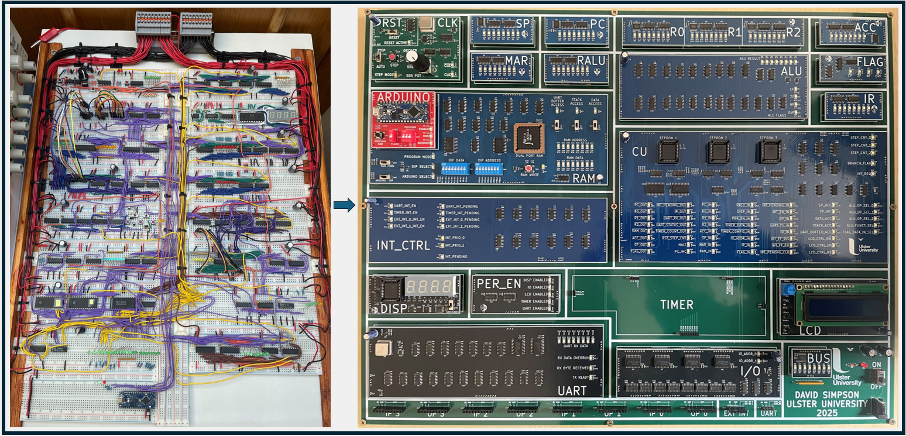
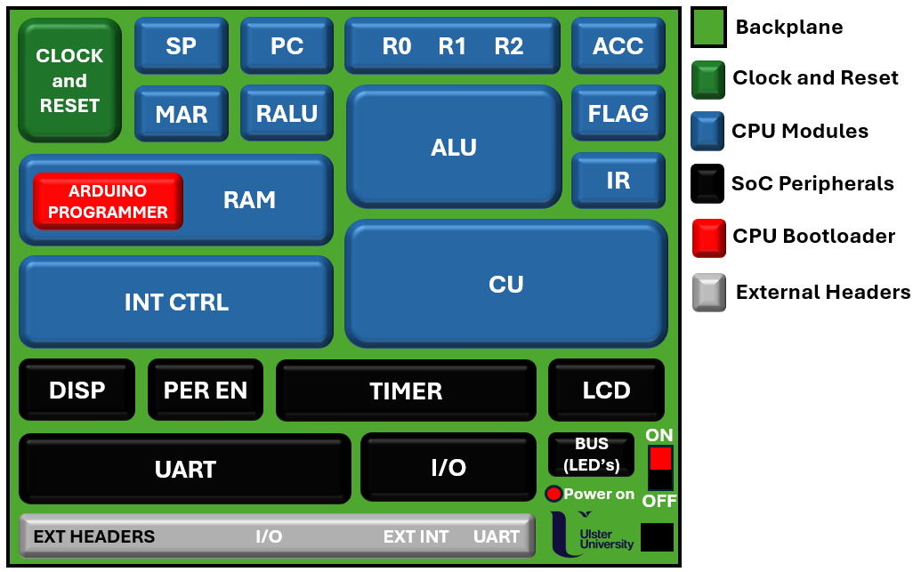
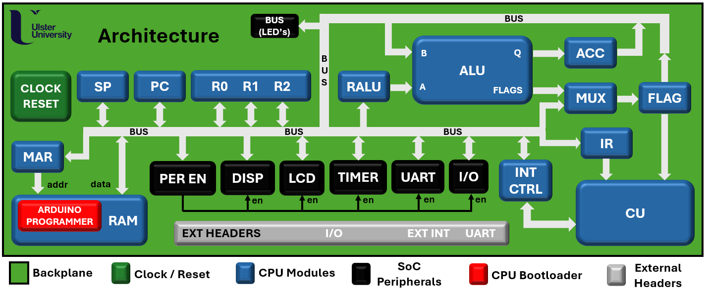

# Educational 8-bit CPU / SoC

  

## Project Overview

Alongside my part-time undergraduate studies in Electrical & Electronic Engineering at Ulster University, I created a simple 8-bit CPU using discrete TTL ICs on breadboards. What started as an electronics project quickly became a deep interest in computer architecture CPU hardware. Now at the end of my PhD, I revisited the project in my free time and created an improved SoC-based, CMOS version on PCBs. This updated design will be provided to Ulster University so that others can interact with and learn how CPUs work at a basic level. The goal of this repo is to provide a learning CPU/SoC platform that others can use.

🚧 **Still Work in Progress: Core CPU hardware is functional. The SoC peripherals are complete except for the TIMER PCB. Additionally, both the FPGA implementation and Python emulator are coming shortly! The project is worked on in free time**.

The PCB board files are shared here if anybody wants to recreate the design. Additionally, a Python emulator and FPGA implementation of the CPU/SoC will also be shared here soon. This repository will host the complete open-source project including:

🔨 Schematics, PCB and Gerber files

🐍 A custom Python assembler

🖥️ A Python-based CPU emulator for replicating without the hardware

💻 An FPGA implementation of the CPU/SoC

📚 Documentation

🧩 Example programs and tutorials

---

## Hardware Layout

A layout of the hardware setup can be viewed below:

  

---

## Architecture

The architecture is shown below in more detail. The core CPU PCBs are printed blue and the SoC peripherals are printed black, as highlighted on the diagram.

  

---

## CPU / SoC Features

- **Variable clock speeds. Programs can be run in two modes:**
  - Single-step mode – step by step execution with a push button
  - Auto mode – run continuously with either a variable 555 timer clock (~1 Hz to ~1kHz) or a fixed 1 MHz oscillator
- **Two programming modes:**
  - Manually with DIP switches to select memory address and instructions / data
  - Automatically with a custom Arduino Nano PCB and shift registers
- **1kB total system memory (dual port SRAM IC):**
  - 256 bytes of program memory (read-only)
  - 256 bytes of data memory
  - 256 bytes of stack memory
  - 256 bytes for UART buffer memory
- **4 general purpose registers:**
  - r0, r1, r2 and Accumulator (ACC)
- **5 special purpose registers:**
  - Memory Address register (MAR)
  - Program Counter (PC)
  - Stack Pointer (SP)
  - Instruction register (IR)
  - Flag register (FLAG)
- **8-bit ALU with dedicated register (RALU) capable of the following operations:**
  - Add / subtract
  - AND / OR / NOT / XOR
  - Shift left / right (logical)
  - Shift right (arithmetic)
  - Increment / decrement
  - Generates Carry (CF), Zero (ZF), Negative (NF) and Overflow (OVF) flags
- **Micro-coded control unit (CU) with 3 EEPROMs:**
  - Up to 8 micro-steps per instruction
  - Python script generates EEPROM data
- **Instruction-Set-Architecture (ISA):**
  - Load / store
  - Move
  - Arithmetic operations
  - Push / pop
  - Compare
  - Unconditional jump / jump to sub-routine
  - Return from sub-routine / return from interrupt
  - Conditional branches
- **Shared 8-bit data/address bus.**
- **Supported addressing modes:**
  - Immediate
  - Register
  - Direct and indirect
  - SP relative
- **SoC Peripherals:**
  - A peripheral enable register (PER_EN)
  - A 4-digit, seven segment display register (DISP) that can be configured as unsigned or signed representation (two's complement)
  - An LCD display with dedicated read / write instructions
  - A UART at 19,200 baud rate, with status read and receive interrupt
  - A configurable 8-bit timer with 8-bit clock prescaler register, with count read and zero / compare interrupts
  - I/O - 4 general purpose inputs and output ports (32-bits of total I/O)
- **4-channel CPU Interrupt controller (INT_CTRL), all rising-edge triggered:**
  - 2 external
  - 1 UART
  - 1 timer
- **CPU states and registers are shown on LEDs**.

---

## Repo Structure

## Repo Structure

| Folder       | Description                                                                |
|:------------:|:--------------------------------------------------------------------------:|
| `/hardware`  | Schematics, board and Gerber files for the PCB implementation *(ongoing)*. |
| `/software`  | Software for the CPU assembler / bootloader *(ongoing)*.                   |
| `/emulator` | Python CPU/SoC emulator *(ongoing)*.                                      |
| `/fpga`      | FPGA implementation *(ongoing)*.                                           |
| `/docs`      | Documentation and tutorials *(ongoing)*.                                   |
| `/images`    | Repo image folder.                                                         |

---

## Getting Started

Coming soon 👀

Build instructions and user guides will be provided for each of the CPU / SoC implementations:
- Hardware PCB version
- Python Emulator version
- And the FPGA version

---

## Ongoing Work

⚠️ **Note, this project is still in progress and the following tasks are pending:**
✔️ **Core CPU hardware**
☐ **SoC hardware (just Timer PCB remaining)**
☐ **Updated Python assembler**
☐ **Project documentation**
❌ **Python-based CPU/SoC emulator**
❌ **FPGA implementation**
❌ **C compiler**
