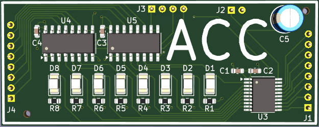
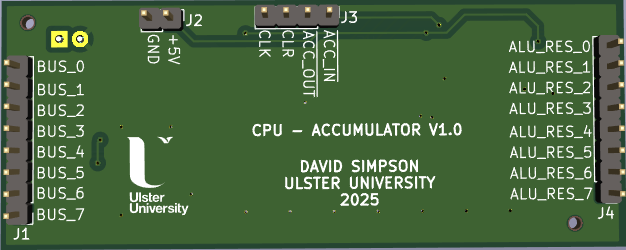
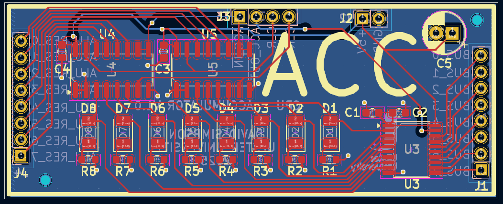

## Accumulator Register (ACC)

Stores the result of all ALU operations, except from compare instructions where the ALU result is discarded.

[View schematic (PDF)](ACC_schematic.pdf)

---

### Details

- Synchronous 8-bit register (74HC173 4-bit IC x2)
- Red LEDs to show register contents
- Tri-state output buffer (74HC245 IC)

---

### Inputs

- 5V / GND
- Clock
- Clear (*asynchronous - active high*)
- ACC in (*synchronous - active low*)
- ACC out (*asynchronous - active low*)
- 8-bit CPU bus

---

### Outputs

- 8-bit ACC contents (*to CPU bus*)

---

### PCB Spec

- Blue
- *2 layer*
- *24 mm × 60.25 mm*

---

### PCB Views

  

<em>Top view of the ACC PCB</em>

  

<em>Bottom view of the ACC PCB</em>

  

<em>Layout view of the ACC PCB</em>

