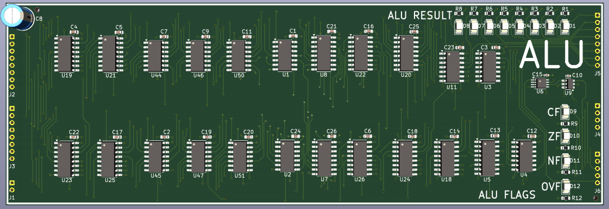
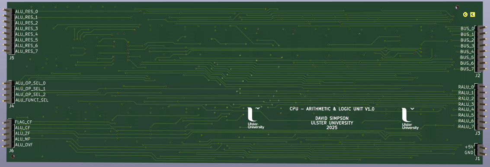
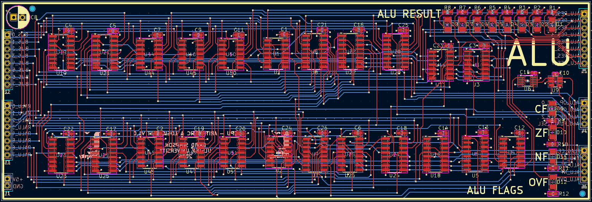

## Arithmetic and Logic Unit (ALU)

Performs the arithmetic or logic operation on the A and B operands, based on the 3-bit ALU op select inputs and the ALU function select input. Generates flags based on the result of the operation.

[View schematic (PDF)](ALU_schematic.pdf)

---

### Details

- Combinational ALU circuit
- Red LEDs to show ALU result
- Yellow LEDs to show ALU flags       

**ALU Truth Table**

| ALU Operation | ALU Operation Select | ALU Function Select |
|:-------------:|:--------------------:|:-------------------:|
|     `ADD`     |         000          |          0          |
|     `SUB`     |         000          |          1          |
|     `AND`     |         001          |          x          |
|     `OR`      |         010          |          x          |
|     `NOT`     |         011          |          x          |
|     `SHR`     |         100          |          0          |
|     `SHRA`    |         100          |          1          |
|     `XOR`     |         110          |          x          |
|     `INC`     |         111          |          0          |
|     `DEC`     |         111          |          1          |

---

### Inputs

- 5V / GND
- 8-bit ALU register (*RALU*)
- 8-bit CPU bus
- 3-bit ALU operation select
- ALU function select
- Carry flag from FLAG register (*to preserve carry flag during certain operations*)

---

### Outputs

- 8-bit ALU contents (*to accumulator register - ACC*)
- 4 flags (*to FLAG register*)

---

### PCB Spec

- *Blue*
- *4 layer*
- *166.25 mm × 56.5 mm*

---

### PCB Views

  

<em>Top view of the ALU PCB</em>

  

<em>Bottom view of the ALU PCB</em>

  

<em>Layout view of the ALU PCB</em>

