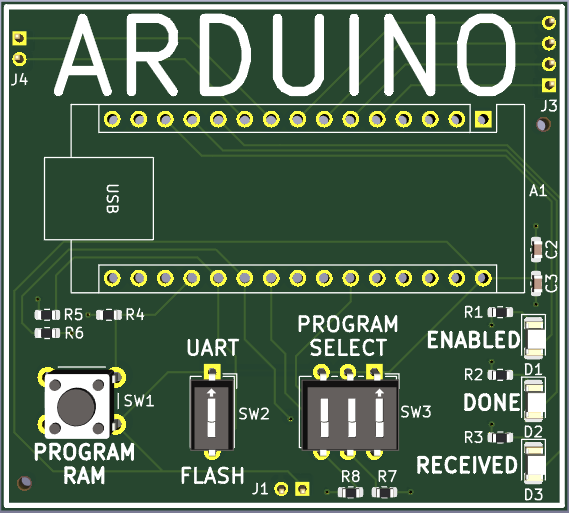
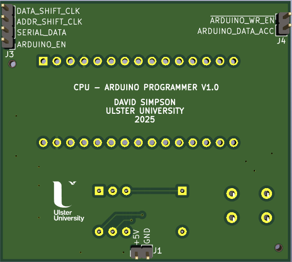
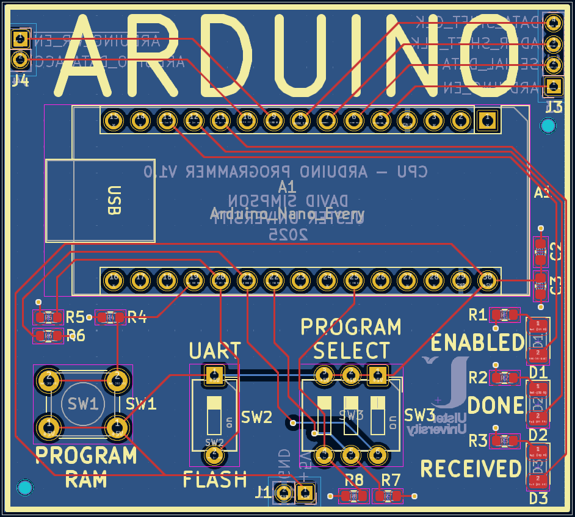

## Arduino Programmer

As opposed to manually entering machine code into program and data memory of the CPU's RAM, an Arduino Nano microcontroller can instead be used at the press of a button. Up to 8 programs can be stored on the Arduino's flash memory and are selected by a 3-bit DIP switch on the PCB. A push button initiates the Arduino programming. 

Additionally, the Arduino was supposed to receive a program over UART from a Python script running on a PC, and a single DIP switch was used to select between either using the UART program or the programs in flash memory for programming. ***However there is a bug in this circuit!***

Given the low number of I/O pins on the Arduino Nano, it communicates with the RAM PCB via two serial-to-parallel shift registers (address and data to write to RAM).

The Arduino software will be available in the `software/arduino` folder soon.

[View schematic (PDF)](ARDUINO_schematic.pdf)

### Bug! 🐛

The Arduino Nano is powered by a 5V on the Vin pin (pin 30). The problem occurs when the USB cable is plugged into the Arduino Nano as the internal regulator will use the USB as the power source instead. The Vin pin then backfeeds and powers the entire CPU / SoC boards. For now, the UART functionality is not used for this reason and the Arduino is simply used to program from flash memory only. This will be addressed in a future revision!

---

### Details

- Arduino Nano microcontroller-based RAM bootloader
- 3-bit program select DIP switch
- UART/flash program select DIP switch
- Program RAM push button
- Yellow LEDs to show the Arduino enable and programming status
- Green LED to indicate that a program was successfully received from Python over UART       

---

### Inputs

- 5V / GND
- Arduino enable (*asynchronous - active high*)

---

### Outputs

- Shift register serial data input (*0 or 1*)
- Address shift register clock  (*asynchronous - active high*)
- Data shift register clock  (*asynchronous - active high*)
- Arduino RAM write enable (*asynchronous - active low*)
- Arduino DATA segment access (*asynchronous - active high*)

---

### PCB Spec

- *Red*
- *2 layer*
- *48.75 mm × 54.25 mm*

---

### PCB Views

  

<em>Top view of the ARDUINO PCB</em>

  

<em>Bottom view of the ARDUINO PCB</em>

  

<em>Layout view of the ARDUINO PCB</em>

