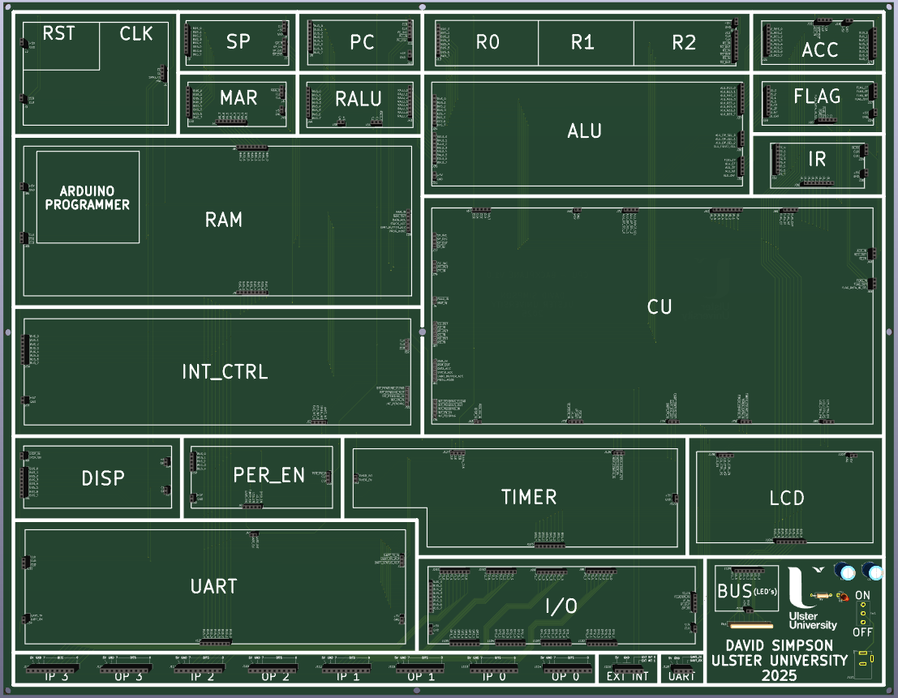
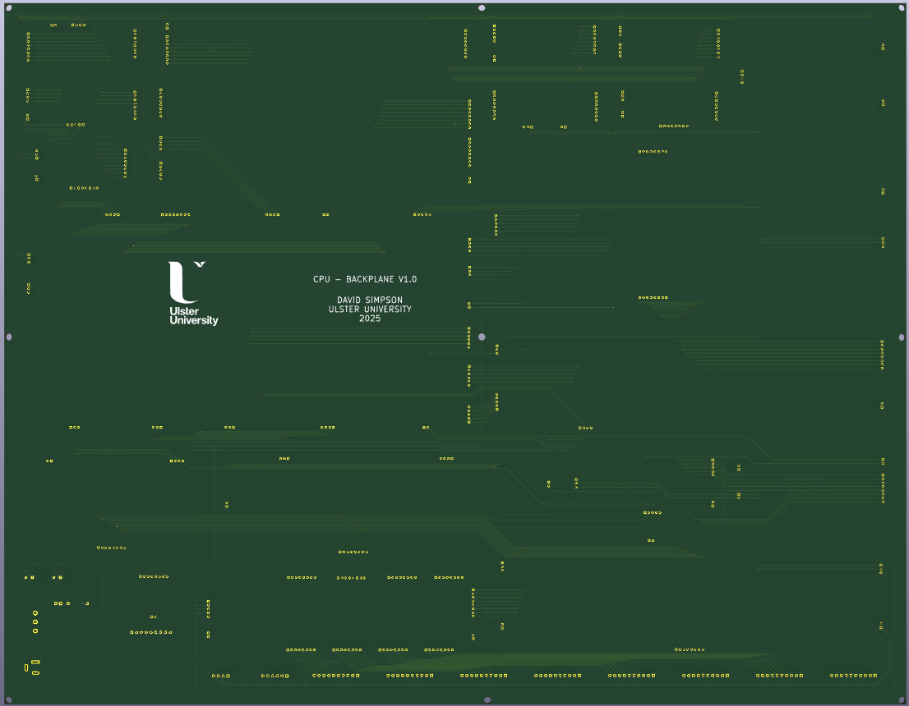
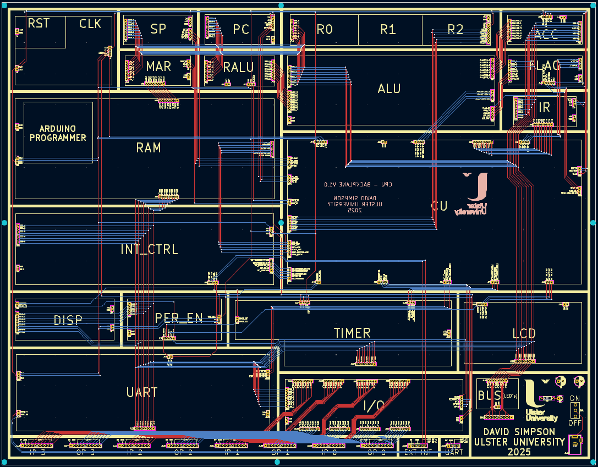

## Backplane

Backplane with sockets for plugging in all the modular components of the CPU / SoC

[View schematic (PDF)](BACKPLANE_schematic.pdf)

---

### Details

- 5V input power barrel jack
- Power on/off switch and power on red led
- 2mm pin sockets for component PCB plug ins
- 2.54mm pin sockets for external connectors (I/O / interrupts)
- 2.54mm pin headers for external UART connector 
- 3.7mm mounting holes (x9)

---

### PCB Spec

- *Green*
- *4 layer*
- *370.37 mm × 475.75 mm*

---

### PCB Views

  

<em>Top view of the BACKPLANE PCB</em>

  

<em>Bottom view of the BACKPLANE PCB</em>

  

<em>Layout view of the BACKPLANE PCB</em>

