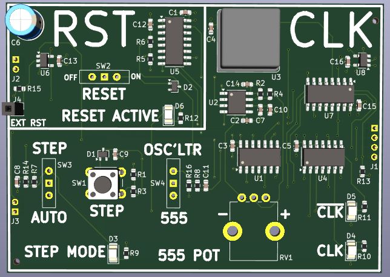
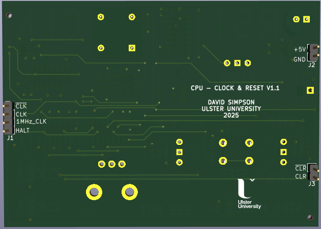
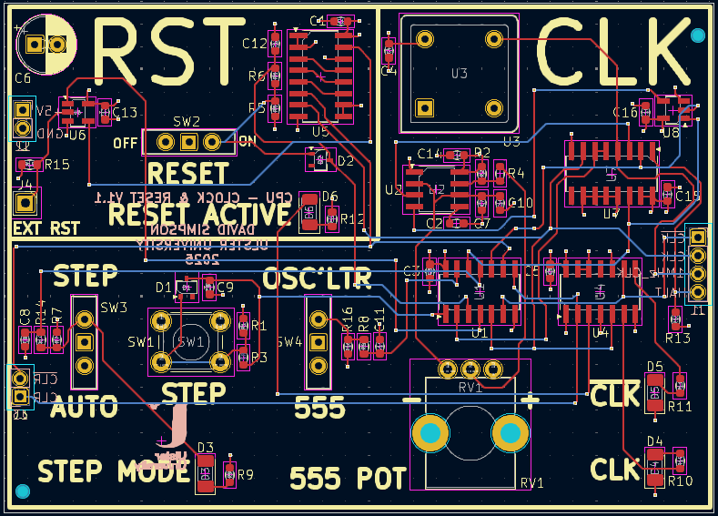

## Clock and Reset

Generates the clock and reset signals for the complete CPU and SoC hardware.

[View schematic (PDF)](CLOCK_and_RESET_schematic.pdf)

---

### Details

- Single step clock mode with push button (de-bounced with RC + 74HC14 schmitt trigger inverter IC)
- Auto clock mode from either a 555 timer + potentiometer, or a fixed 1MHz oscillator.
- Switches to select the clock source using a 4-1 mux (74HC153).
- Reset is controlled with 4 flip flops (74HC173 - asserted asynchronously and de-asserted synchronously).

---

### Inputs

- 5V / GND
- External reset (*asynchronous - active high*)
- Halt input (*asynchronous - active high*)

---

### Outputs

- Clock and inverted clock
- Clear and inverted clear
- 1MHz clock (not used)

---

### PCB Spec

- *4 layer*
- *56 mm × 78 mm*

---

### PCB Views

  

<em>Top view of the Clock and Reset PCB</em>

  

<em>Bottom view of the Clock and Reset PCB</em>

  

<em>Layout view of the Clock and Reset PCB</em>

