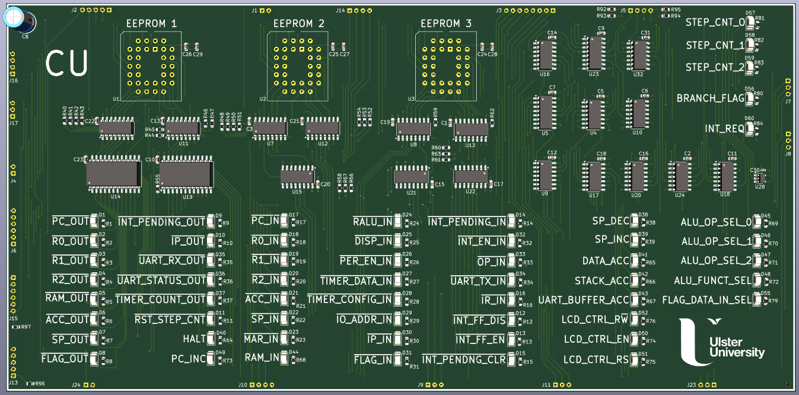
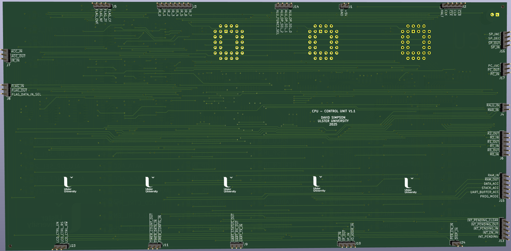
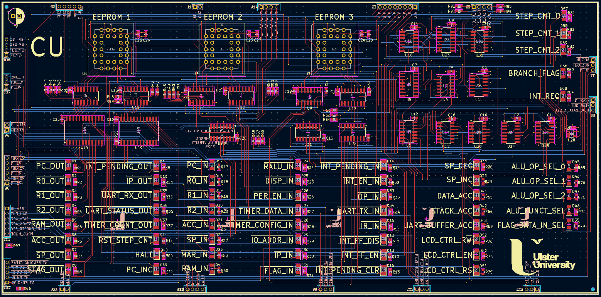

## Control Unit (CU)

Generates all control signals for hardware components on the CPU/SoC. The control logic is micro-coded using EEPROMs with output registers and decoding logic. The status of all control signals and other important CPU states are indicated with LEDs.

[View schematic (PDF)](CU_schematic.pdf)

---

### Details

- Generates control signals for all components
- Microcode stored in EEPROMs (AT28C64B ICs x3)
- EEPROM output registers (74HC173 4-bit register ICs - x2 per EEPROM)
- EEPROM output registers decoders (74HC138 ICs x2, 74HC238 ICs x1, 74HC154 ICs x2)
- 3-bit step counter for multi-cycle instruction execution steps
- Interrupt request issuer (74CH74 D-FF IC x1)
- Branch flag logic multiplexor (74HC151 8-1 mux IC x1)
- White LEDs to show step counter
- Green LEDs to show active control signals
- Yellow LED to show the branch flag status
- Red LED to show the interrupt request line status       

---

### Inputs

- 5V / GND
- Clock / inverted clock
- Clear (*asynchronous - active high*)
- Inverted clear (*asynchronous - active low*)
- Interrupt pending (*synchronous - active high*)
- 8-bit instruction register contents (*IR*)
- 4-bit flag register contents (*FLAG*)
- Program mode (*from RAM PCB*)

---

### Outputs

- Control signals for CPU / SoC components

---

### PCB Spec

- *Blue*
- *4 layer*
- *116.5 mm × 236.75 mm*

---

### PCB Views

  

<em>Top view of the CU PCB</em>

  

<em>Bottom view of the CU PCB</em>

  

<em>Layout view of the CU PCB</em>

