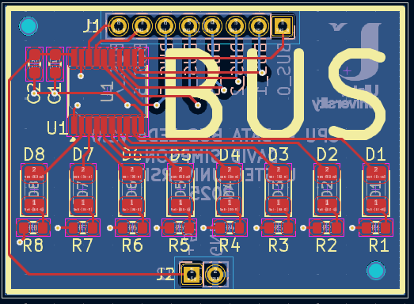

## Data Bus LED's (BUS)

Buffers and drives LEDs to show the 8-bit CPU / SoC bus.

[View schematic (PDF)](DATA_BUS_LEDs_schematic.pdf)

---

### Details

- Tri-state buffer (74HC245 IC)
- Red LEDs to show bus contents

---

### Inputs

- 5V / GND
- 8-bit CPU bus

---

### Outputs

*None*

---

### PCB Spec

- Black
- *2 layer*
- *25.25 mm × 34.75 mm*

---

### PCB Views

  

<em>Top view of the Data Bus LED's PCB</em>

  

<em>Bottom view of the Data Bus LED's PCB</em>

  

<em>Layout view of the Data Bus LED's PCB</em>

