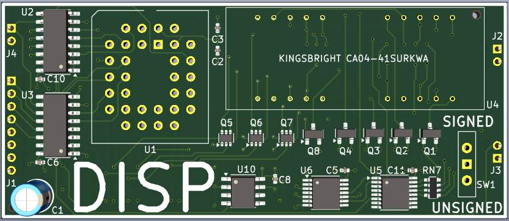
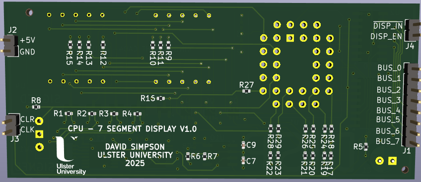
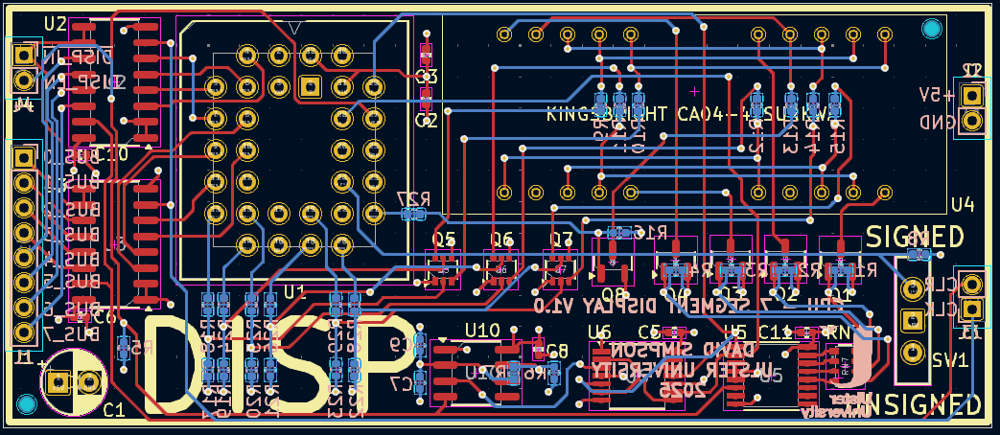

## Display Register (DISP)

Displays the contents of the Display register on a 4-digit, 7-segment display. A switch selects whether the data is to be displayed as an unsigned or signed byte. The display bit must first be set in the peripheral enable resgister.

[View schematic (PDF)](DISP_schematic.pdf)

---

### Details

- Synchronous 8-bit register (74HC173 4-bit IC x2)
- 555 timer and 2-bit synchronous counter (74HC74) to select the digit
- 2-4 decoder (74HC138) drives the corresponding cathode through P-channel MOSFETs (AO3401A)
- Pre-programmed EEPROM (AT28C64B) outputs sink the segments low through NPN BJTs (MMDT2222)

---

### Inputs

- 5V / GND
- Clock
- Clear (*asynchronous - active high*)
- DISP enable (*asynchronous - active high*)
- DISP in (*synchronous - active low*)
- 8-bit CPU bus

---

### Outputs

*None*

---

### PCB Spec

- Black
- *4 layer*
- *34 mm × 79.25 mm*

---

### PCB Views

  

<em>Top view of the DISP PCB</em>

  

<em>Bottom view of the DISP PCB</em>

  

<em>Layout view of the DISP PCB</em>

