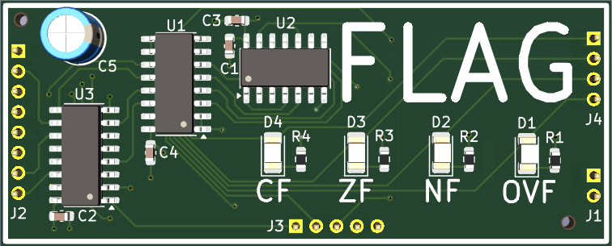
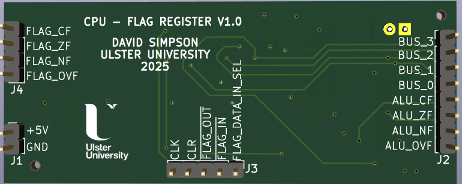
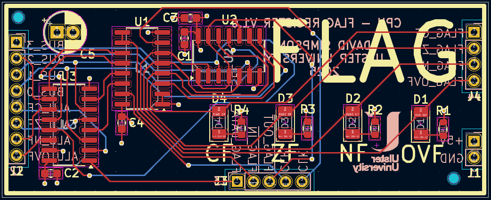

## Flag Register (FLAG)

Stores the result of all ALU operations, except from compare instructions where the ALU result is discarded.

[View schematic (PDF)](FLAG_schematic.pdf)

---

### Details

- Data in select (74HC157 2-1 mux IC)
- Synchronous 4-bit register (74HC173 4-bit IC)
- Green LEDs to show flags
- Tri-state output buffer (74HC125 IC)

---

### Inputs

- 5V / GND
- Clock
- Clear (*asynchronous - active high*)
- FLAG in (*synchronous - active low*)
- FLAG out (*asynchronous - active low*)
- FLAG data in select (*mux select - 0 = ALU flags, 1 = CPU bus*)
- 4-bit CPU bus
- 4-bit ALU flags

---

### Outputs

- 4-bit FLAG contents (*to CPU control unit - CU*)
- 4-bit FLAG contents (*to CPU bus*)

---

### PCB Spec

- Blue
- *4 layer*
- *24.25 mm × 60 mm*

---

### PCB Views

  

<em>Top view of the FLAG PCB</em>

  

<em>Bottom view of the FLAG PCB</em>

  

<em>Layout view of the FLAG PCB</em>

