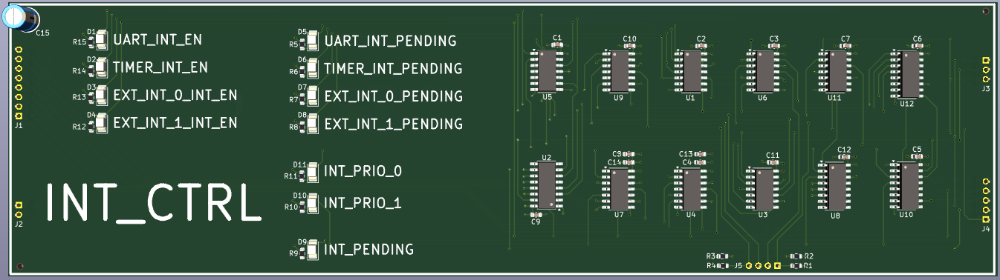
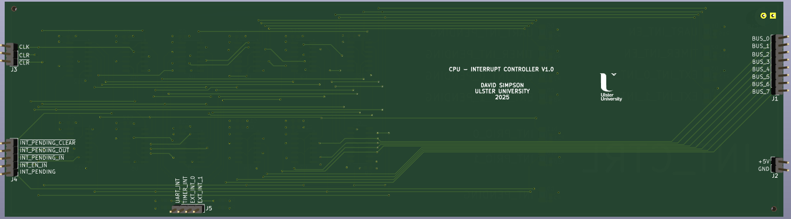
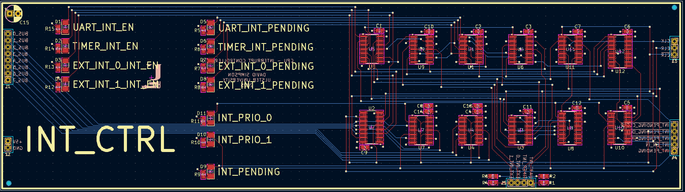

## Interrupt Controller (INT_CTRL)

Four interrupts are supported on this CPU: UART, timer and two external signals. The interrupt controller processes the asynchronous interrupts, notifies and issues the CPU with the highest priority interrupt that is pending. Interrupts use a vector table to allow the CPU to locate the correct software handler when an interrupt occurs. The CPU indexes a fixed table of vector addresses, which contain pointers to the interrupt service routines (ISRs).

[View schematic (PDF)](INT_CTRL_schematic.pdf)

---

### Details

- 4-bit synchronous interrupt enable register (74HC173 4-bit IC x1)
- Interrupt source latches (74HC74 dual D-type FF IC x2)
- 4-bit interrupt priority encoder (74HC148 IC x1)
- Interrupt pending flip flop (74HC74 D-type FF)
- 4-bit synchronous interrupt priority register (74HC173 4-bit IC x1)
- 4-bit interrupt pending clear decoder (74HC139 decoder IC x1 and 74HC08 AND gates)
- Tri-state 8-bit output buffer (74HC125 IC x2)
- Red LEDs to show interrupt enabled bits
- Yellow LEDs to show the interrupt pending latch bits
- White LEDs to show the interrupt priority register bits
- Green LED to show the interrupt pending output to the CPU control unit (CU)

**Interrupt Vector Table**

| Interrupt | Priority | Priority Encoding | Interrupt Vector Entry |
|:---------:|:--------:|:-----------------:|:----------------------:|
| UART      | Highest  |         00        |           0xFC         |
| TIMER     | High     |         01        |           0xFD         |
| EXT INT 0 | Low      |         10        |           0xFE         |
| EXT INT 1 | Lowest   |         11        |           0xFF         |

---

### Inputs

- 5V / GND
- Clock
- Clear (*asynchronous - active high*)
- Inverted clear (*asynchronous - active low*)
- UART interrupt source  (*asynchronous - active rising edge*)
- TIMER interrupt source  (*asynchronous - active rising edge*)
- External interrupt 0 source  (*asynchronous - active rising edge*)
- External interrupt 1 source  (*asynchronous - active rising edge*)
- Interrupt enable register in (*asynchronous - active low*)
- Interrupt pending register in (*asynchronous - active low*)
- Interrupt pending register out (*asynchronous - active low*)
- Interrupt pending clear (*synchronous - active low*)
- 8-bit CPU bus

---

### Outputs

- Interrupt pending (*synchronous - active high*)

---

### PCB Spec

- *Blue*
- *4 layer*
- *57.75 mm × 207.75 mm*

---

### PCB Views

  

<em>Top view of the INT_CTRL PCB</em>

  

<em>Bottom view of the INT_CTRL PCB</em>

  

<em>Layout view of the INT_CTRL PCB</em>

