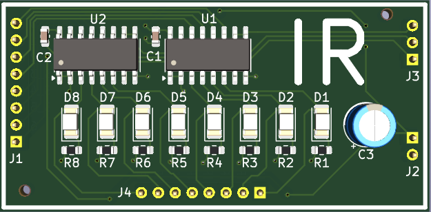
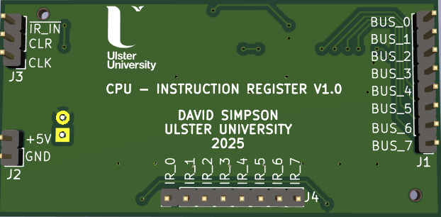
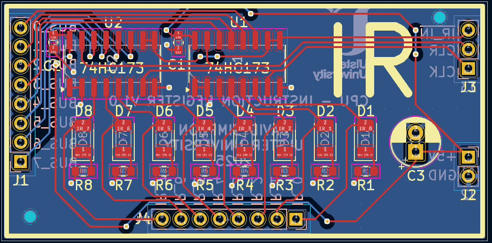

## Instruction Register (IR)

Stores the instruction currently being executed by the CPU.

[View schematic (PDF)](IR_schematic.pdf)

---

### Details

- Synchronous 8-bit register (74HC173 4-bit IC x2)
- Green LEDs to show register contents

---

### Inputs

- 5V / GND
- Clock
- Clear (*asynchronous - active high*)
- IR in (*synchronous - active low*)
- 8-bit CPU bus

---

### Outputs

- 8-bit IR contents (*to CPU control unit - CU*)

---

### PCB Spec

- *2 layer*
- *25 mm × 50.75 mm*

---

### PCB Views

  

<em>Top view of the IR PCB</em>

  

<em>Bottom view of the IR PCB</em>

  

<em>Layout view of the IR PCB</em>

