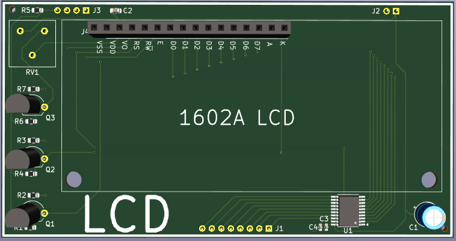
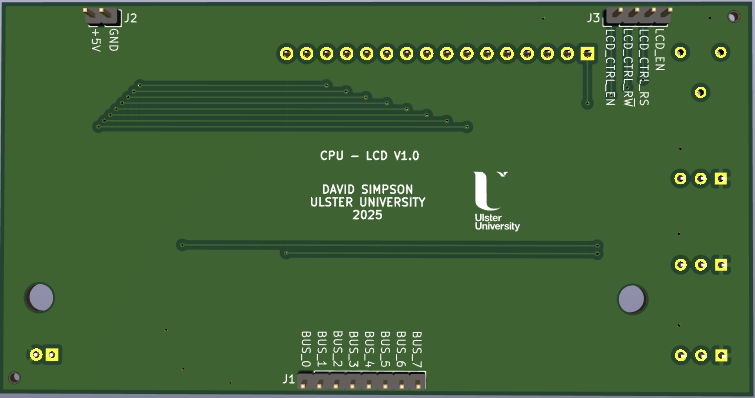
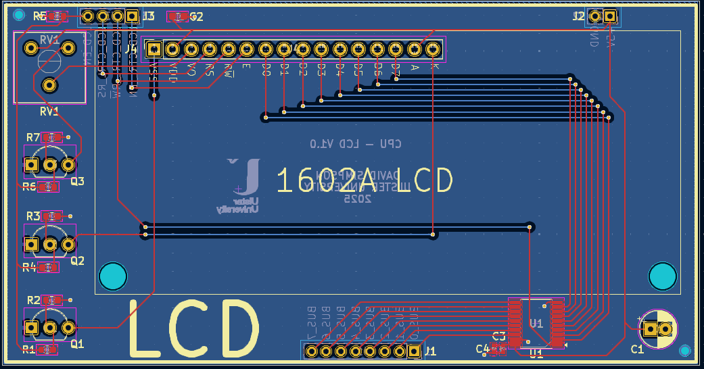

## LCD

The CPU can write to and read from the LCD display. The LCD bit must first be set in the peripheral enable resgister.

[View schematic (PDF)](LCD_schematic.pdf)

---

### Details

- 16 x 2 LCD display with write and read capability.
- A tri-state buffer controls the data direction (74HC245 IC).

---

### Inputs

- 5V / GND
- LCD enable (*asynchronous - active high*)
- LCD control en (*asynchronous*)
- LCD control rw (*asynchronous*)
- LCD control rs (*asynchronous*)
- 8-bit CPU bus

---

### Outputs

- 8-bit LCD output read data

---

### PCB Spec

- *Black*
- *2 layer*
- *49.75 mm × 95.25 mm*

---

### PCB Views

  

<em>Top view of the LCD PCB</em>

  

<em>Bottom view of the LCD PCB</em>

  

<em>Layout view of the LCD PCB</em>

