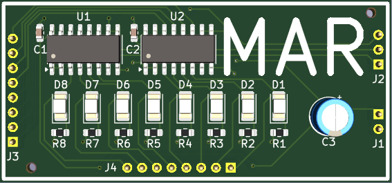
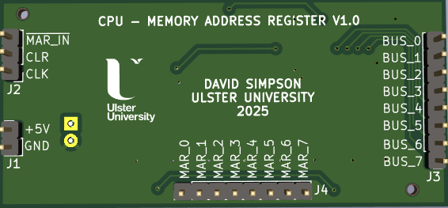
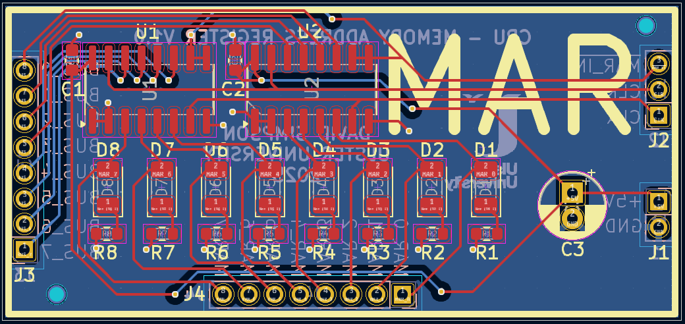

## Memory Address Register (MAR)

Stores the address for CPU memory accesses.

[View schematic (PDF)](MAR_schematic.pdf)

---

### Details

- Synchronous 8-bit register (74HC173 4-bit IC x2)
- blue LEDs to show register contents

---

### Inputs

- 5V / GND
- Clock
- Clear (*asynchronous - active high*)
- MAR in (*synchronous - active low*)
- 8-bit CPU bus

---

### Outputs

- 8-bit MAR contents (*to RAM memory address*)

---

### PCB Spec

- *2 layer*
- *24.75 mm × 53 mm*

---

### PCB Views

  

<em>Top view of the MAR PCB</em>

  

<em>Bottom view of the MAR PCB</em>

  

<em>Layout view of the MAR PCB</em>

