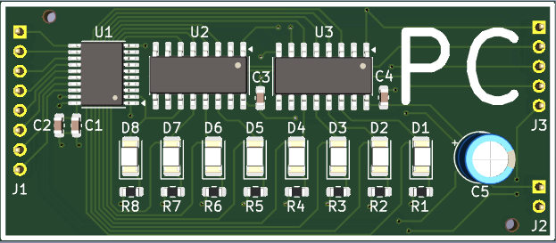
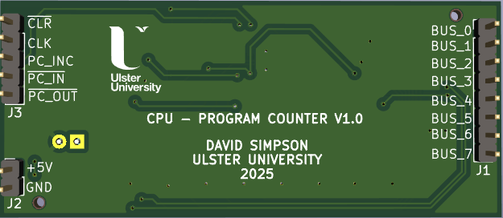
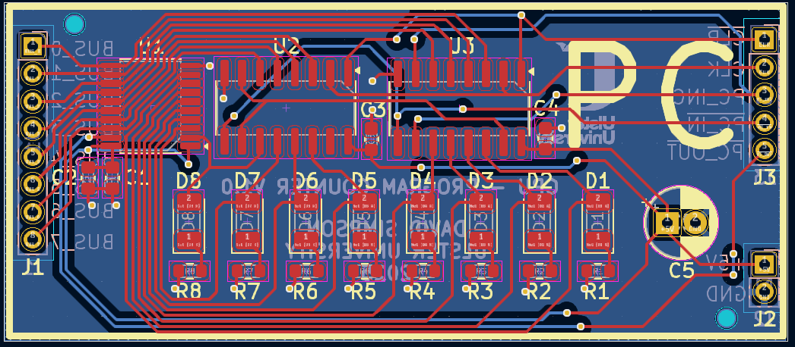

## Program Counter Register (PC)

Stores the address of the current instruction being executed by the CPU.

[View schematic (PDF)](PC_schematic.pdf)

---

### Details

- Synchronous 8-bit register (74HC173 4-bit IC x2)
- blue LEDs to show register contents
- Tri-state output buffer (74HC245 IC)

---

### Inputs

- 5V / GND
- Clock
- Clear (*asynchronous - active low*)
- PC in (*synchronous - active low*)
- PC increment (*synchronous - active high*)
- PC out (*asynchronous - active low*)
- 8-bit CPU bus

---

### Outputs

- 8-bit PC contents (*to CPU bus*)

---

### PCB Spec

- *2 layer*
- *24.5 mm × 56.5 mm*

---

### PCB Views

  

<em>Top view of the PC PCB</em>

  

<em>Bottom view of the PC PCB</em>

  

<em>Layout view of the PC PCB</em>

