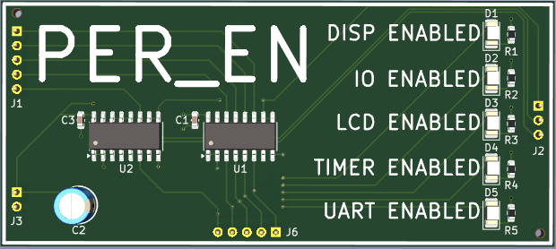
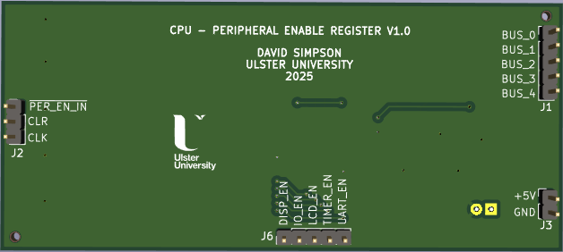
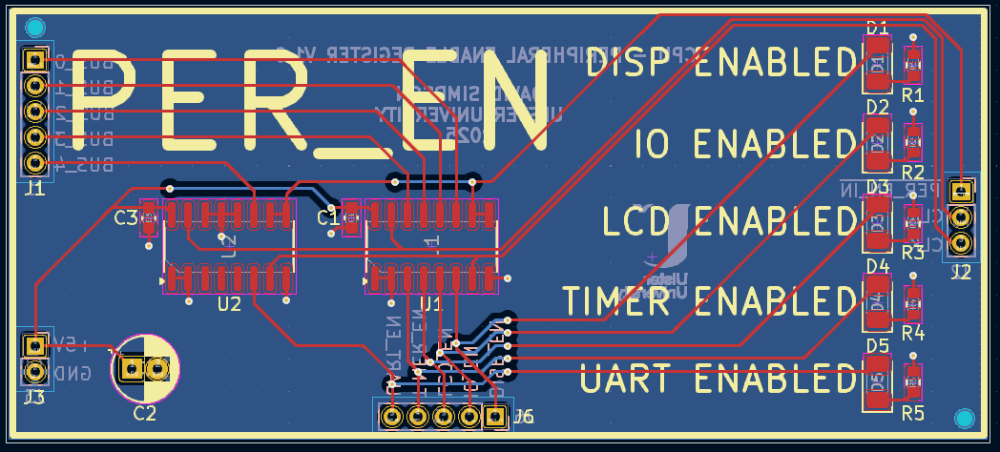

## Peripheral Enable Register (PER_EN)

Stores the enable bits for the 5 SoC peripherals (DISP, LCD, I/O, UART and TIMER).

[View schematic (PDF)](PER_EN_schematic.pdf)

---

### Details

- Synchronous 5-bit register (74HC173 4-bit IC x2)
- Red LEDs to show register contents

---

### Inputs

- 5V / GND
- Clock
- Clear (*asynchronous - active high*)
- PER_EN in (*synchronous - active low*)
- 5-bits of CPU bus

---

### Outputs

- 5-bits of PER_EN contents (*to SoC peripherals - DISP, LCD, I/O, UART and TIMER*)

---

### PCB Spec

- *Black*
- *2 layer*
- *34 mm × 76.5 mm*

---

### PCB Views

  

<em>Top view of the PER_EN PCB</em>

  

<em>Bottom view of the PER_EN PCB</em>

  

<em>Layout view of the PER_EN PCB</em>

