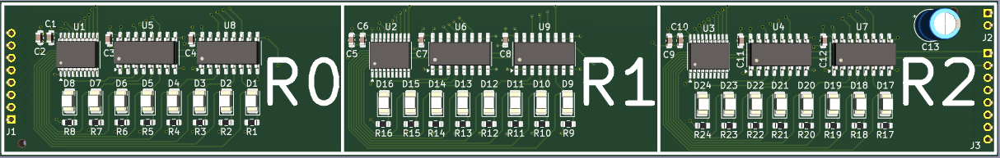
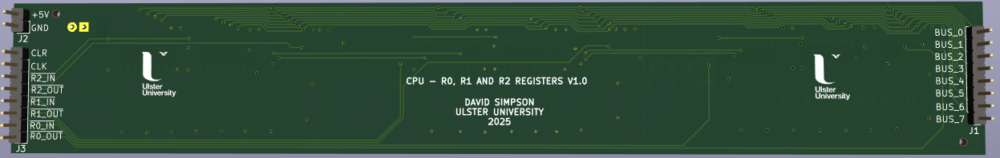
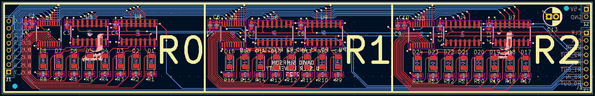

## R0, R1 and R2 Registers (r0, r1 & r2)

General purpose registers. All 3 registers are on a single PCB.

[View schematic (PDF)](R0_R1_R2_schematic.pdf)

---

### Details

Each register: 

- Synchronous 8-bit register (74HC173 4-bit IC x2)
- Red LEDs to show register contents
- Tri-state output buffer (74HC245 IC)

---

### Inputs

- 5V / GND
- Clock
- Clear (*asynchronous - active high*)
- r0/r1/r2 in (*synchronous - active low*)
- r0/r1/r2 out (*asynchronous - active low*)
- 8-bit CPU bus

---

### Outputs

- 8-bit r0/r1/r2 contents (*to CPU bus*)

---

### PCB Spec

- *Blue*
- *4 layer*
- *25.25 mm × 161 mm*

---

### PCB Views

  

<em>Top view of the r0_r1_r2 PCB</em>

  

<em>Bottom view of the r0_r1_r2 PCB</em>

  

<em>Layout view of the r0_r1_r2 PCB</em>

