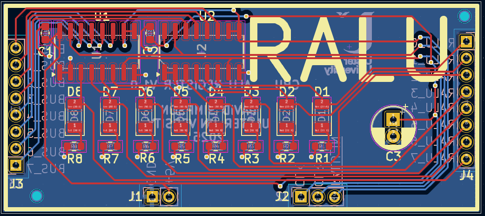

## ALU Register (RALU)

Stores the A operand for an ALU operation.

[View schematic (PDF)](RALU_schematic.pdf)

---

### Details

- Synchronous 8-bit register (74HC173 4-bit IC x2)
- Amber LEDs to show register contents

---

### Inputs

- 5V / GND
- Clock
- Clear (*asynchronous - active high*)
- RALU in (*synchronous - active low*)
- 8-bit CPU bus

---

### Outputs

- 8-bit RALU contents (*to ALU operand A*)

---

### PCB Spec

- *Blue*
- *2 layer*
- *25.25 mm × 57.25 mm*

---

### PCB Views

  

<em>Top view of the RALU PCB</em>

  

<em>Bottom view of the RALU PCB</em>

  

<em>Layout view of the RALU PCB</em>

