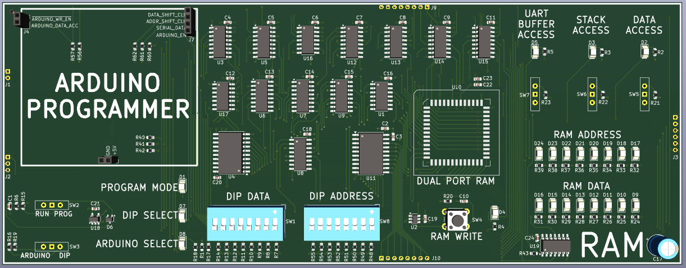
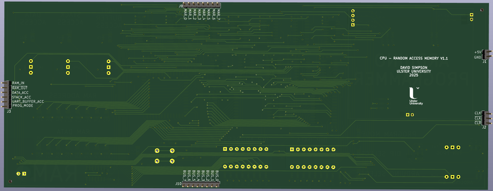
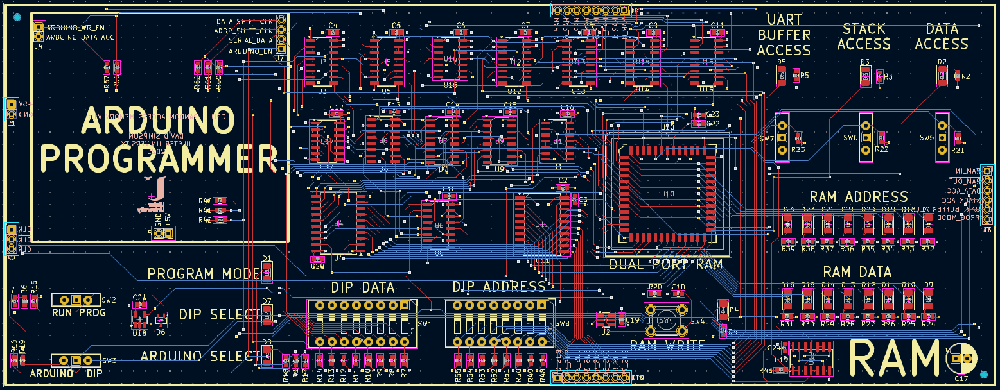

## RAM

The CPU can access a total of **1 KB of memory** using a dual-port SRAM IC (*IDT7132*). Memory is divided into four 256-byte segments, each selected by 3 segment bits.  

- **Program and Data memory** can be loaded either manually via DIP switches on the PCB, or automatically using a plug-in Arduino Nano programmer.  
- **Bytes are addressed** with an 8-bit address (`0x00–0xFF`) plus the 3-bit segment select. 

[View schematic (PDF)](RAM_schematic.pdf)

**Memory map**

| Memory Region      | Size      | Address Range | Segment Select | Access      |
|:------------------:|:---------:|:-------------:|:--------------:|:-----------:|
| Program Memory     | 256 bytes | 0x00–0xFF     | 000            | Read-only   |
| Data Memory        | 256 bytes | 0x00–0xFF     | 001            | Read/Write  |
| Stack Memory       | 256 bytes | 0x00–0xFF     | 010            | Read/Write  |
| UART Buffer Memory | 256 bytes | 0x00–0xFF     | 100            | Read/Write  |

---

### Details

- RAM write data multiplexors (74HC157 2-1 mux IC x4)
- RAM read/write address multiplexors (74HC157 2-1 mux IC x4)
- Switch to select CPU program and run modes
- Switch to select DIP switch or Arduino programming - uses multiplexors (74HC157 2-1 mux IC x2)
- Shift registers for Arduino serial programming (74HC164 serial-to-parallel IC x2)
- Push button to write DIP switch data to RAM
- Blue LEDs to show the memory location address
- Orange LEDs to show the RAM data at the addressed memory location

---

### Inputs

- 5V / GND
- Clock
- Clear (*asynchronous - active high*)
- Inverted clear (*asynchronous - active low*)
- RAM in (*synchronous - active high*)
- RAM out (*synchronous - active low*)
- DATA access (*asynchronous - active high*)
- STACK access (*asynchronous - active high*)
- UART BUFFER access (*asynchronous - active high*)
- 8-bit CPU bus
- 8-bit Memory Address Register (*MAR*)

---

### Outputs

- 8-bit RAM contents (*to CPU bus*)
- Program mode (*asynchronous - active high*)

---

### Arduino Connectors

**Inputs**

- 5V / GND
- Arduino write enable (*asynchronous - active low*)
- Arduino DATA access (*asynchronous - active high*)
- Arduino serial data (*asynchronous - active high*)
- Arduino address shift clock (*asynchronous - active high*)
- Arduino data shift clock (*asynchronous - active high*)

**Outputs**

- Arduino enable (*asynchronous - active high*)

---

### PCB Spec

- *Blue*
- *4 layer*
- *80.5 mm × 208 mm*

---

### PCB Views

  

<em>Top view of the RAM PCB</em>

  

<em>Bottom view of the RAM PCB</em>

  

<em>Layout view of the RAM PCB</em>

