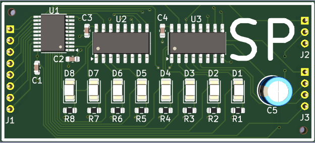
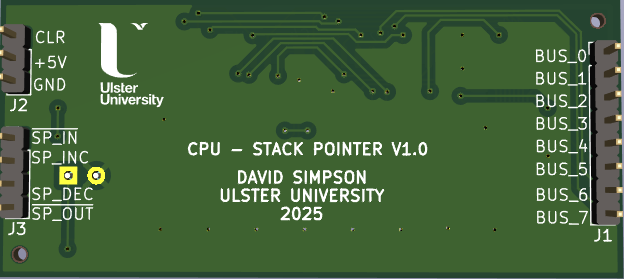
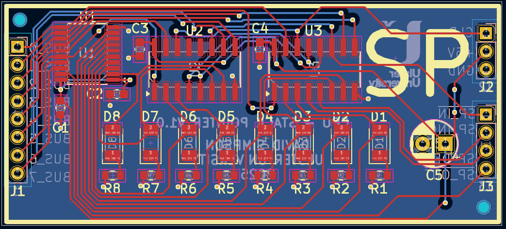

## Stack Pointer Register (SP)

Stores the address pointer in stack memory.

[View schematic (PDF)](SP_schematic.pdf)

---

### Details

- Asynchronous 8-bit up/down counter (74HC193 4-bit IC x2)
- Blue LEDs to show register contents
- Tri-state output buffer (74HC245 IC)

---

### Inputs

- 5V / GND
- Clear (*asynchronous - active low*)
- SP in (*asynchronous - active low*)
- SP increment (*asynchronous - active high*)
- SP decrement (*asynchronous - active high*)
- 8-bit CPU bus

---

### Outputs

- 8-bit SP contents (*to CPU bus*)

---

### PCB Spec

- *Blue*
- *2 layer*
- *24.75 mm × 22.25 mm*

---

### PCB Views

  

<em>Top view of the SP PCB</em>

  

<em>Bottom view of the SP PCB</em>

  

<em>Layout view of the SP PCB</em>

