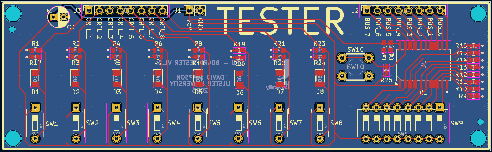

## Tester

Provides a quick method of verifying correct behaviour of PCBs, using DIP switches and a 8-bit bus buffer.

[View schematic (PDF)](TESTER_schematic.pdf)

---

### Details

- Two 8-bit DIP switches
- Green LEDs to show the 8 single control signal DIP switches
- Tri-state bus output buffer (74HC245 IC)

---

### Inputs

- 5V / GND

---

### Outputs

- 8-bit DIP switch (*to CPU bus or genenal control signal use*)
- 8 single bit DIP switches (*genenal control signal use*)

---

### PCB Spec

- *White*
- *2 layer*
- *36.25 mm × 118.75 mm*

---

### PCB Views

  

<em>Top view of the TESTER PCB</em>

  

<em>Bottom view of the TESTER PCB</em>

  

<em>Layout view of the TESTER PCB</em>

