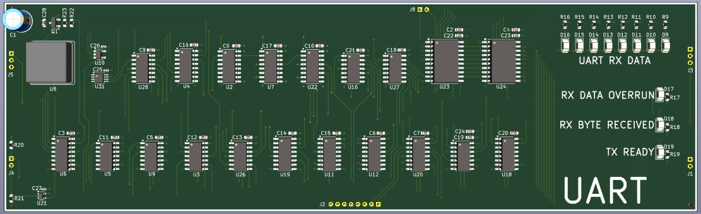
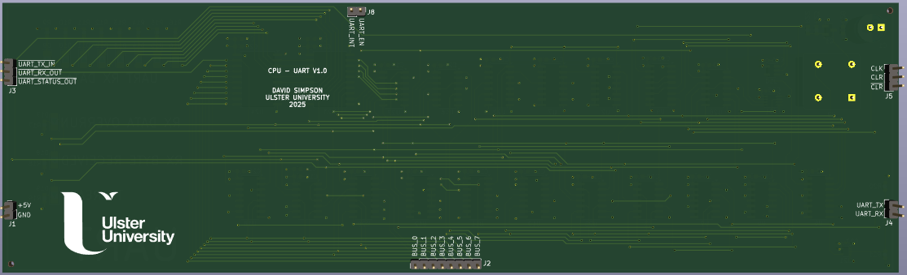
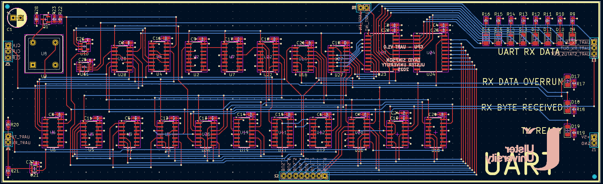

## UART

UART peripheral capable of transmitting and receving bytes at a fixed baud rate of 19,200. Can generate an interrupt everytime a new byte is received. The status of the UART transmit and receive circuits can be read by the CPU software.

[View schematic (PDF)](UART_schematic.pdf)

---

### Details

- UART data frame -> 1 start bit, 8 data bits, 1 stop bit, no parity bits
- 
- ?? LEDs to show the UART byte received

---

### Inputs

UPDATE ....

- 5V / GND
- Clock
- Clear (*asynchronous - active high*) - NOT USED
- Inverted clear (*asynchronous - active low*) - NOT USED
- UART enable
- 
- 8-bit CPU bus

---

### Outputs

- 8-bit UART receive byte latch contents / UART status bits (*to CPU bus*)
- UART interrupt (*asynchronous - active high*)

---

### PCB Spec

- *Black*
- *4 layer*
- *61.75 mm × 204.25 mm*

---

### PCB Views

  

<em>Top view of the UART PCB</em>

  

<em>Bottom view of the UART PCB</em>

  

<em>Layout view of the UART PCB</em>

